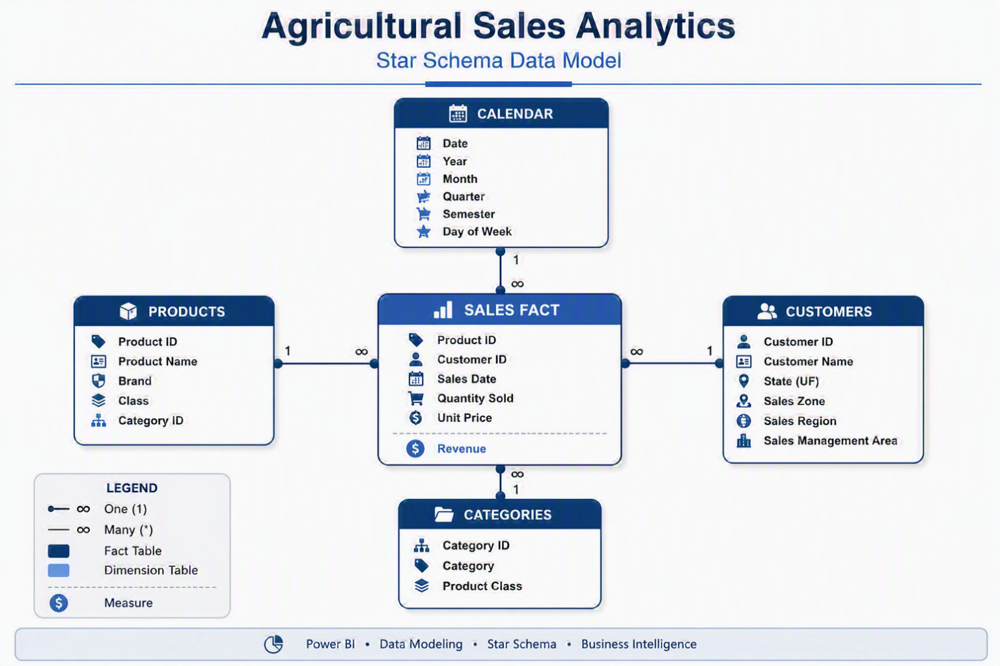

# 🚜 Agricultural Sales Analytics Dashboard


An end-to-end Business Intelligence project developed in Power BI to analyze sales performance, customer behavior, product portfolio, regional distribution, and revenue trends across multiple years.

The solution combines dimensional modeling, DAX calculations, interactive reporting, and business analytics to support data-driven decision making.

---


 # 📑 Table of Contents

- Dashboard Preview
- Project Highlights
- Project Overview
- Business Questions
- Data Model
- Data Source
- Analytics Capabilities
- Key Metrics
- Report Pages
- Project Structure
- Sample Data
- Power BI Features
- Sample DAX Measures
- Getting Started
- Business Value
- Technologies Used
- What This Project Demonstrates
- Disclaimer
- Author
- Contact


---

# 📊 Dashboard Preview


---

# 🎯 Project Highlights

- Interactive Power BI Dashboard
- Star Schema Data Model
- Revenue Analytics
- Customer Analytics
- Product Portfolio Analysis
- Geographic Performance Monitoring
- Advanced DAX Measures
- Time Intelligence
- KPI Monitoring
- Executive Reporting

---

# 🚀 Project Overview

This project analyzes agricultural equipment sales across multiple regions, brands, products, and customers.

The dashboard provides a centralized commercial analytics environment that enables users to:

- Monitor revenue performance
- Compare yearly results
- Analyze seasonality patterns
- Evaluate product portfolio performance
- Identify top-performing customers
- Analyze regional sales distribution
- Support strategic and operational decisions

---

# ❓ Business Questions

The dashboard was designed to answer questions such as:

- How has revenue evolved over time?
- Which regions generate the highest revenue?
- Which products drive sales performance?
- Who are the top customers by revenue?
- Which customers purchase the fewest products?
- How do brands compare?
- Are there seasonal sales patterns?
- Which product categories contribute most to revenue?

---

# 🏗️ Data Model

The solution follows a dimensional modeling approach using a star schema.



## Fact Table

```text
Sales
```

Main metrics:

- Quantity Sold
- Unit Price
- Revenue

## Dimension Tables

```text
Customers
Products
Categories
Calendar
```

---

# 📂 Data Source

The dataset used in this project was originally provided as part of a Business Intelligence training exercise.

All customers, products, transactions and business entities are fictional and intended exclusively for educational purposes.

No confidential or proprietary business information is included.

---

# 📈 Analytics Capabilities

## Revenue Analysis

- Total Revenue
- Revenue Evolution
- Monthly Comparison
- Annual Comparison
- Revenue Growth Analysis

## Customer Analysis

- Top Customers
- Bottom Customers
- Revenue Concentration
- Purchase Volume Analysis

## Product Analysis

- Product Performance
- Category Performance
- Brand Comparison
- Product Ranking

## Geographic Analysis

- Revenue by State
- Revenue by Region
- Sales Management Performance
- Regional Revenue Distribution

## Time Intelligence

- Year-over-Year (YoY)
- Year-to-Date (YTD)
- Monthly Trends
- Annual Trends
- Seasonality Analysis

---

# 📊 Key Metrics

The dashboard includes key business indicators such as:

- Total Revenue
- Revenue by Year
- Revenue by Month
- Revenue Growth (%)
- Revenue by Brand
- Revenue by Category
- Revenue by Region
- Quantity Sold
- Top Customers
- Top Products

---

# 📑 Report Pages

## 1. Revenue Overview & Seasonality

Provides a consolidated view of commercial performance.

Includes:

- Revenue KPIs
- Monthly Revenue Trends
- Year-over-Year Comparison
- Revenue Growth Analysis
- Seasonality Monitoring

---

## 2. Portfolio & Regional Analysis

Provides visibility into product performance and geographic distribution.

Includes:

- Revenue by Product Category
- Revenue by Brand
- Revenue by Sales Management Area
- Geographic Sales Distribution
- Product Rankings

---

## 3. Customer Analytics

Provides detailed customer performance analysis.

Includes:

- Top Customers by Revenue
- Bottom Customers by Purchase Volume
- Customer Contribution Analysis
- Commercial Performance Monitoring

---

# 📁 Project Structure

```text
agricultural-sales-analytics-dashboard/
│
├── dashboard/
│   ├── sales_overview.png
│   ├── portfolio_analysis.png
│   └── customer_analysis.png
│
├── power_bi/
│   └── Agricultural_Sales_Analytics.pbix
│
├── sample_data/
│   ├── customers.csv
│   ├── products.csv
│   ├── categories.csv
│   ├── sales.csv
│   ├── calendar.csv
│   └── README.md
│
└── README.md
```

---

# 📊 Sample Data

Sample datasets are included to demonstrate the complete analytical workflow.

```text
sample_data/
├── customers.csv
├── products.csv
├── categories.csv
├── sales.csv
└── calendar.csv
```

For detailed dataset documentation, see:

```text
sample_data/README.md
```

---

# 💻 Power BI Features

The report demonstrates several Power BI capabilities:

- Star Schema Modeling
- DAX Measures
- Time Intelligence
- KPI Cards
- Interactive Slicers
- Drill-Down Analysis
- Geographic Maps
- Ranking Analysis
- Dynamic Filtering
- Executive Dashboards

---

# 🧮 Sample DAX Measures

### Revenue

```DAX
Revenue =
SUMX(
    Sales,
    Sales[Quantity Sold] * Sales[Unit Price]
)
```

### Revenue YTD

```DAX
Revenue YTD =
TOTALYTD(
    [Revenue],
    Calendar[Date]
)
```

### Revenue Growth %

```DAX
Revenue Growth % =
DIVIDE(
    [Revenue] - [Revenue Previous Year],
    [Revenue Previous Year]
)
```

---

# 🚀 Getting Started

## Requirements

```text
Power BI Desktop
```

---

## Open the Project

```text
power_bi/
└── Agricultural_Sales_Analytics.pbix
```

---

## Explore the Dashboard

Available filters include:

- Year
- Brand
- Product Class
- State
- Sales Region

---

# 📈 Business Value

The dashboard provides a centralized environment for monitoring commercial performance and supporting strategic decisions.

Key benefits include:

- Improved visibility into sales performance
- Faster access to commercial insights
- Better customer understanding
- Enhanced product portfolio management
- Revenue trend monitoring
- Regional performance comparison
- KPI governance and tracking

---

# 🧩 Technologies Used

- Power BI
- DAX
- Power Query
- Data Modeling
- Star Schema
- Business Intelligence

---

# 🧠 What This Project Demonstrates

- Business Intelligence Development
- Dashboard Design
- Data Visualization
- DAX Development
- Data Modeling
- KPI Monitoring
- Revenue Analytics
- Customer Analytics
- Product Analytics
- Geographic Analysis
- Executive Reporting

---

# 🔒 Disclaimer

This repository contains a portfolio version of a Business Intelligence project developed using a fictional training dataset.

- No confidential information is included
- No proprietary business information is included
- Sample data is provided exclusively for educational and portfolio purposes

---

# 👤 Author

Data Analytics professional with experience in:

- Power BI
- DAX
- Data Modeling
- Business Intelligence
- Data Engineering
- Analytics Engineering

---

# 📬 Contact

Feel free to connect or reach out to discuss:

- Power BI
- Business Intelligence
- Data Analytics
- Data Engineering
- Dashboard Development
- Data Visualization
